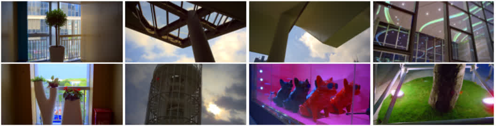
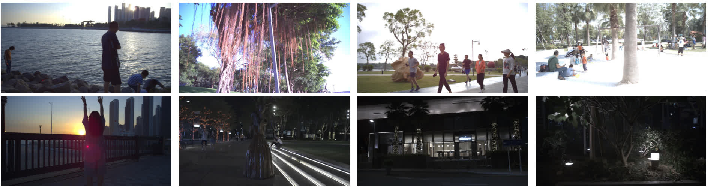

# Datasets for HDR Video Reconstruction 

This repository describes the training and testing datasets used in **[HDR Video Reconstruction: A Coarse-to-fine Network and A Real-world Benchmark Dataset, ICCV 2021](http://guanyingc.github.io/DeepHDRVideo/)**. We also provide the python scripts used for processing the raw data and capturing real data. Python scripts in this repository work with python 3.5+.

Datasets can be download in [Google Drive](https://drive.google.com/drive/folders/10CzRavlDob7QkI5zAtQSWLfxeOUPRFZD?usp=sharing) or BaiduYun (TODO). Thumbnails for the captured dataset can be found in [this page](https://guanyingc.github.io/DeepHDRVideo-Dataset/).

## Table of Contents

* [Publicly Available Resources](#publicly-available-resources)
  * [HDR videos](#hdr-videos)
  * [Videos captured with alternating exposures](#videos-captured-with-alternating-exposures)
* [Synthetic Dataset](#synthetic-dataset)
  * [Synthetic training dataset](#synthetic-training-dataset)
  * [Synthetic test dataset](#synthetic-test-dataset)
* [The Captured Real-world Dataset](#the-captured-real-world-dataset)
  * [Camera control code](#camera-control-code)
  * [Real-world static dataset with GT HDR](#real-world-static-scene-dataset-with-gt-hdr)
  * [Real-world dynamic dataset with GT HDR](#real-world-dynamic-dataset-with-gt-hdr)
  * [Real-world dynamic dataset without GT HDR](#real-world-dynamic-dataset-without-gt-hdr)
* [Citation](#citation)

## Publicly Available Resources
### HDR videos
- Cinematic Wide Gamut HDR video: https://www.hdm-stuttgart.de/vmlab/hdm-hdr-2014/.
- LiU HDRv Repository - Resources: http://www.hdrv.org/Resources.php.

A copy of the above two datasets can be found in Google Drive (`Online_HDR_Dataset/`) in case you cannot download them. Please acknowledge the corresponding papers if you use them.

### Videos captured with alternating exposures
- Kalantari13 dataset: this dataset consists of 9 videos for dynamic scenes in RGB image format: https://www.ece.ucsb.edu/~psen/PaperPages/HDRVideo/.

We used this dataset for qualitative evaluation. The prepared dataset can be found in Google Drive (`Real_Dataset/TOG13_Dynamic_Dataset.tgz`). 

<details>
    <summary>Directory structure</summary>

```shell
TOG13_Dynamic_Dataset/
├── 2Exp_scenes.txt # list of 2-exposure scenes
├── 3Exp_scenes.txt # list of 3-exposure scenes
├── BaslerCRF.mat # camera response function
├── CheckingEmail-3Exp-2Stop/
│   ├── Affine_Trans_Matrices/ # precomputed similarity transformation between neighboring frames
│   ├── Exposures.txt # exposure information
│   ├── HDR/ # HDR estimation of Kalantari13's method
│   ├── HDR_TOG13_PyTM/ # tonemapped results Kalantari13's method
│   ├── img_hdr_list.txt # list of paired image and hdr
│   ├── img_list.txt # list of images
│   └── TMInfo.txt # parameters for Reinhard et al.'s method
├── Cleaning-3Exp-2Stop/
│   └── ...
├── Dog-3Exp-2Stop/
│   └── ...
├── Fire-2Exp-3Stop/
│   └── ...
├── Ninja-2Exp-3Stop/
│   └── ...
├── ThrowingTowel-2Exp-3Stop/
│   └── ...
├── TMinfo.txt
└── WavingHands-2Exp-3Stop/
    └── ...
```
</details>

## Synthetic Dataset
Since there is no publicly available real video dataset with alternating exposures and their ground-truth HDR, we resort to synthetic data for training. 

### Synthetic training dataset

We generate the synthetic training dataset using 21 videos from [Cinematic Wide Gamut HDR-video](https://www.hdm-stuttgart.de/vmlab/hdm-hdr-2014/) ([list of 13 videos](./data/cinematic_13_list.txt)) and [LiU HDRv Repository - Resources](http://www.hdrv.org/Resources.php) ([list of 8 videos](./data/Liu_8_list.txt)). 
To generate the synthetic training data, we first cropped 7-frame HDR patches and save them as 16bit numpy arrays to hard disk. During training, We re-expose the HDR images into LDR images in an on-line manner.
The command for cropping patches is as follows:
```shell
# please create a scenes.txt file that stores the scene list in /path/to/HDR/videos/.
python gen_syn_train_dataset.py --in_dir /path/to/HDR/videos/
```

The prepared datasets can be downloaded in Google Drive (`Synthetic_Dataset/`).
<details>
    <summary>Directory structure</summary>

```
Synthetic_Train_Data_LiU_HDRv
├── Images
│   ├── bridge
│   ├── bridge_2
│   ├── hallway
│   ├── hallway2
│   ├── river
│   ├── students
│   ├── water
│   └── window
├── list.txt
├── train_list.txt
└── val_list.txt

Synthetic_Train_Data_HdM-HDR-2014
├── Images
│   ├── bistro_01
│   ├── bistro_02
│   ├── bistro_03
│   ├── cars_closeshot
│   ├── cars_fullshot
│   ├── cars_longshot
│   ├── fireplace_01
│   ├── fireplace_02
│   ├── hdr_testimage
│   ├── showgirl_01
│   ├── showgirl_02
│   ├── smith_hammering
│   └── smith_welding
├── list.txt
├── train_list.txt
└── val_list.txt
```

</details>


### Synthetic test dataset
The synthetic test dataset was generated using two HDR videos (i.e., `POKER FULLSHOT` and `CAROUSEL FIREWORKS`) from [Cinematic Wide Gamut HDR-video](https://www.hdm-stuttgart.de/vmlab/hdm-hdr-2014/), which are not used for training. Each video contains 60 frames and has a resolution of 1920 × 1080. Random Gaussian noise was added to the low-exposure images.
The source HDR videos can be found in Google Drive (`Synthetic_Dataset/HDR_Source_Videos_for_Sythetic_Testset.tgz`). To generate videos with alternating exposures, you can run
```shell
# for two alternating exposures
python gen_syn_test_dataset.py --in_dir /path/to/HDR_Source_Videos_for_Sythetic_Testset --expo_n 2
# for three alternating exposures
python gen_syn_test_dataset.py --in_dir /path/to/HDR_Source_Videos_for_Sythetic_Testset --expo_n 3
```
The generated videos with alternating exposures can be found in Google Drive (`Synthetic_Dataset/HDR_Synthetic_Test_Dataset.tgz`).


## The Captured Real-world Dataset
### Camera control code
To facilitate a more comprehensive evaluation on real data, we captured a real-world dataset and generated reliable ground truth HDR for evaluation. We used an off-the-shelf [Basler acA4095-30uc camera](https://www.baslerweb.com/en/products/cameras/area-scan-cameras/ace/aca4096-30uc/) for capturing videos with alternating exposures (i.e., two and three exposures) in a variety of scenes.
Three different types of video data are captured, namely, the static scene with GT, dynamic scenes with GT, and dynamic scenes without GT. The python code for controlling the camera can be found in [`./data_capture/`](./data_capture/README.md).

We saved the raw data of the captured videos and performed demosaicing, white balance, color correction, and gamma compression to convert the raw data to RGB data using the recorded metadata. 
In this paper, we rescaled the images to 1536 × 813 for evaluation.

### Real-world static dataset with GT HDR

<p align="center">
    
</p>

This dataset can be found in Google Drive (``Real_Dataset/Static/``).
The captured raw datasets are stored in `static_raw_data_2exp_release.tgz` and `static_raw_data_3exp_release.tgz`.
To generate the RGB image datasets from the captured raw data, you can use the following command:

```shell
# Step 1. Convert Raw to RGB
python cvt_raw_to_rgb_scenes.py --in_dir /path/to/static_raw_data_2exp_release --max_frame_num 6
python cvt_raw_to_rgb_scenes.py --in_dir /path/to/static_raw_data_3exp_release --max_frame_num 9
# The generated RGB dataset are stored in static_RGB_data_2exp_release.tgz and static_RGB_data_3exp_release.tgz

# Step 2. Apply random global motion
python apply_random_motion_static_data.py --in_dir /path/to/static_RGB_data_2exp_release
python apply_random_motion_static_data.py --in_dir /path/to/static_RGB_data_3exp_release
```
The global motion augmented RGB dataset are stored in `static_RGB_data_2exp_rand_motion_release.tgz` and `static_RGB_data_3exp_rand_motion_release.tgz`


### Real-world dynamic dataset with GT HDR
This dataset can be found in Google Drive (`Real_Dataset/Dynamic/`).
Note that we first rearranged the captured raw data according to the description in Section 4 of the paper.
The prepared raw datasets are stored in `dynamic_raw_data_2exp_release.tgz` and `dynamic_raw_data_3exp_release.tgz`.

To generate the RGB images from the captured raw data, you can use the command:
```shell
# Convert Raw to RGB
python cvt_dynamicGT_raw_to_rgb_scenes.py --in_dir /path/to/dynamic_raw_data_2exp_release
python cvt_dynamicGT_raw_to_rgb_scenes.py --in_dir /path/to/dynamic_raw_data_3exp_release
```

The processed RGB datasets are stored in `dynamic_RGB_data_2exp_release.tgz` and `dynamic_RGB_data_3exp_release.tgz`.


### Real-world dynamic dataset without GT HDR
<p align="center">
    
</p>

This dataset can be found in Google Drive (`Real_Dataset/Dynamic_noGT/`).
The captured raw data are stored in `dynamic_raw_data_noGT_2exp.tgz` and `dynamic_raw_data_noGT_3exp.tgz`.

Similarly, you can obtain the RGB images using the command:
```
python cvt_raw_to_rgb_scenes.py --in_dir /path/to/dynamic_raw_data_noGT_2exp --merge_hdr # do not merge hdr
python cvt_raw_to_rgb_scenes.py --in_dir /path/to/dynamic_raw_data_noGT_3exp --merge_hdr # do not merge hdr
```

## Citation
If you find this dataset or code useful in your research, please consider citing: 
```
@article{chen2021hdr,
  title={{HDR} Video Reconstruction: A Coarse-to-fine Network and A Real-world Benchmark Dataset},
  author={Chen, Guanying and Chen, Chaofeng and Guo, Shi and Liang, Zhetong and Wong, Kwan-Yee K and Zhang, Lei},
  journal=ICCV,
  year={2021}
}
```

