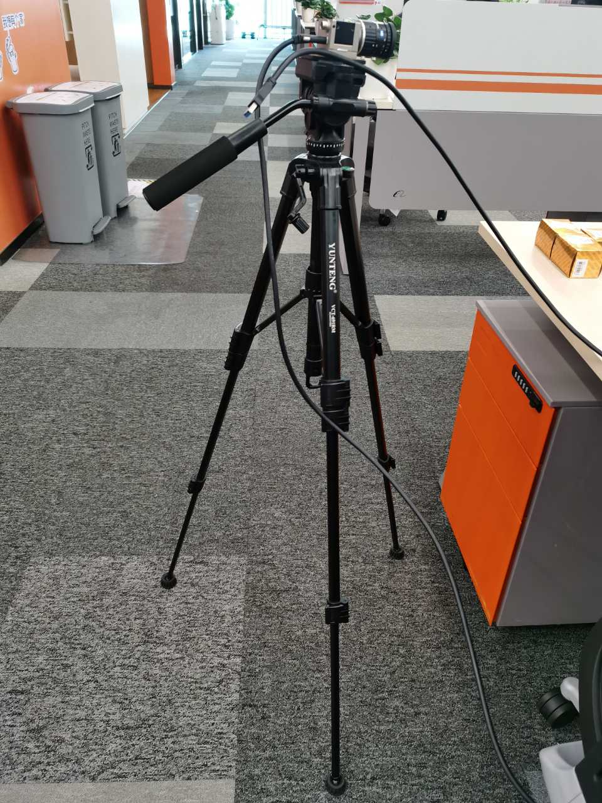
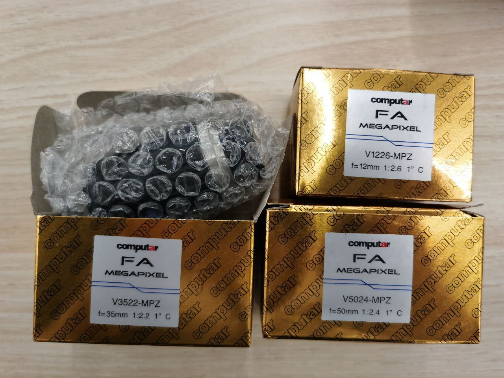
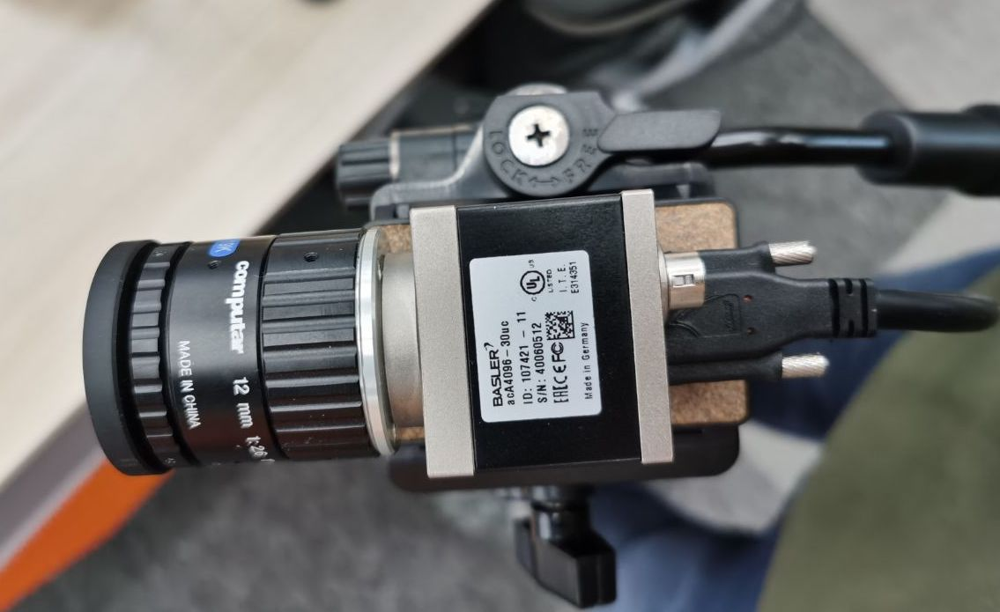

# Camera Usage

## Device
We used 1x camera (aca4096-30uc), 1x tripod, 1x USB cable, and 3x lens (1x 12mm, 1x 35mm, 1x50mm).

<p align="center">
    
    
    
</p>

## Useful Links
- Camera model: https://www.baslerweb.com/cn/products/cameras/area-scan-cameras/ace/aca4096-30uc/.

- Official documentation: https://docs.baslerweb.com/sequencer-(usb-cameras).

- Official Camera Software Suite Windows: https://www.baslerweb.com/en/sales-support/downloads/software-downloads/pylon-6-1-1-windows/. This software is useful for preview.

- python wrapper for pylon: https://github.com/basler/pypylo://github.com/basler/pypylon.

- An example of using the [sequencer feature](https://docs.baslerweb.com/sequencer-(usb-cameras)) for capturing multi-exposure image: https://github.com/basler/pypylon/issues/67.

## Commands for Data Capturing 
As we cannot capture the raw data and RGB image simultaneously, we achieve this goal in two steps.
We first capture the raw data (BayerRG12) and save the raw data and metadata in hard disk as `.npy` files (see [`sequencer.py`](./sequencer.py)).
We then convert the raw data to RGB image by performing demosaicing, white balance, color correction, and gamma compression (gamma=2.2) (see [`./digital_ISP.py`](./digital_ISP.py)).

The following are commands for data capturing. Please first install the python wrapper for pylon [(pypylon)](https://github.com/basler/pypylo://github.com/basler/pypylon).

### Reset the camera
```shell
python reset_camera.py
```

### Auto-calibrate the white balance 
When capturing a new scene, you can first use [pylon viewer](https://www.baslerweb.com/en/sales-support/downloads/software-downloads/pylon-6-1-1-windows/) for preview.
Then you can run this command to calibrate the white balance. The metadata is stored in `./meta_data.npy`, including white balance and color correction matrix.
```shell
python auto_wb_gain.py
# Please see the captured image in results/date_auto_wb_gain
```

### Capturing sequences with alternating exposure using the sequencer feature
When processing the raw data to RGB image, the program will load the white balance and color correction matrix from `./meta_data.npy`.
Please see the captured images in `results/`.

```shell
# Capture a sequence with 3 different exposures separated by 2 stops, 
# The base exposure is set to 1000us, and a maximum of 9 frames are captured
python sequencer.py --base_expo 1000  --expo_n 3 --stop 2 --max_num 9

# You can also use the simplified commands with --params/-p, 
# The first value is the base exposure, the second value is the number of exposure
# The third value is the stop, the fourth value is the maximum number of images
python sequencer.py -p 1000,3,2,9

# Capture a sequence with 3 different exposures separated by 2 stops, 
# The base exposure is set to 1000us, and keep capturing for 2 seconds
python sequencer.py --base_expo 1000 --expo_n 3 --stop 2 --max_num -1 --sec 2

# You can also use the simplified commands with --params/-p, 
# The first value is the base exposure, the second value is the number of exposure
# The third value is the stop, the fourth value is the maximum number of images (-1 means disable)
# The fifth value is the number of seconds
python sequencer.py -p 1000,3,2,-1,2

# By default the gain is set to 0, you can manually specify the gain as follows
python sequencer.py -p 1000,3,2,-1,2 --gain 10

```
### Other useful arguments 
- `--pixelf`: an argument specifies the pixel format (BayerRG12|BayerRG12p|BayerRG8|BGR8|Mono8|YCbCr422_8), we use `BayerRG12p` by default.
- `--merge_hdr`: an argument determines whether to merge the HDR image
- `--sleep_t`: an argument specifies the sleeping time in seconds before the capturing.
- `--process_raw`: an argument specifies if convert the raw data to RGB image
- `--ratio`: a factor for downsampling the image size when generating the RGB image (0.375 by default). With a ratio of 0.375, the size of the raw data is `4096×2168` and the size of RGB image is `1536x813`.
